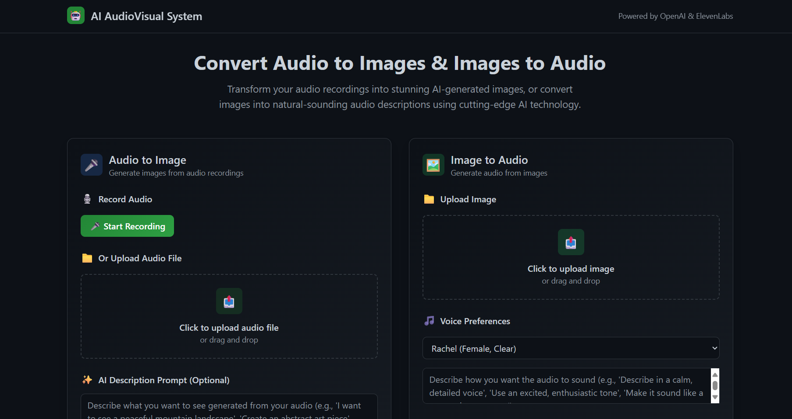
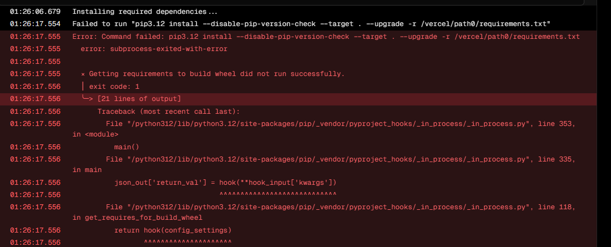

# Audiovisual Interconversion System

The Audiovisual Interconversion System is a web application that utilizes machine learning models to convert between audio and image formats. It allows users to convert audio files into corresponding image representations, as well as convert image files into audio representations.



## About the project
The application is built using Django, a high-level Python web framework, and leverages the TensorFlow library for machine learning tasks. The audio-to-image conversion is achieved using a pre-trained model that converts audio spectrograms into images, while the image-to-audio conversion is achieved using a pre-trained model that converts images into audio spectrograms.

## How to use the app
### 1. Launch your command prompt
Open your command prompt/terminal by typing `cmd` in the search bar of your computer and pressing `Enter`.

### 2. Clone the repository
You can clone the repository by running the following command in your terminal:
```bash
git clone <project directory>
```

### 3. Navigate to the project directory
You can navigate to the project directory by running the following command in your terminal:
```bash
cd <project directory>
```

### 4. Install the required packages
You can install the required packages by running the following command in your terminal:
```bash
pip install -r requirements.txt
```
Wait for the packages to install.

### 5. Run the app
You can run the app by running the following command in your terminal:
```bash
python manage.py runserver
```
You should get a message like this:
```bash
Watching for file changes with StatReloader
Performing system checks...

System check identified no issues (0 silenced).
May 11, 2024 - 10:10:52
Django version 4.2.13, using settings 'audiovisual_sys.settings'
Starting development server at http://127.0.0.1:8000/
Quit the server with CONTROL-C.
```

### 6. Open the app in your browser
You can open the app in your browser by navigating to the following URL:
```bash
http://127.0.0.1:8000/
```

### Extra: Debugging the project
In the process of dedpendencies installation, some packages might require an extra installation to run. If you run into the error in the image below:


You can go to the link below to download visual studio:

https://visualstudio.microsoft.com/thank-you-downloading-visual-studio/?sku=Community&channel=Release&version=VS2022&source=VSLandingPage&cid=2030&passive=false

Follow the installation prompts and install.

### Installing the required package
On installation, launch the application and click on the Web Development
